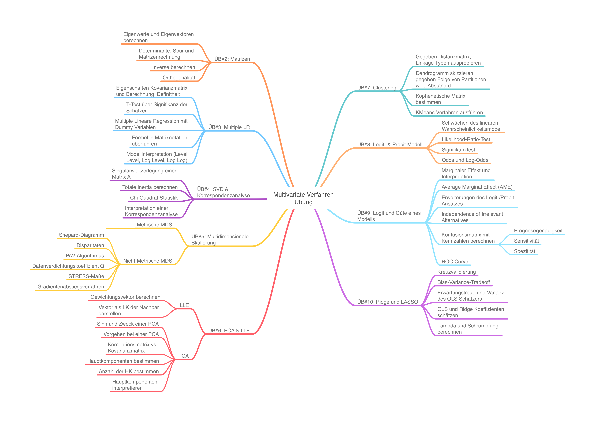

# About this Repository 📘🚀
This repository contains small python exercises in order to strengthen the recently learned 
from the lecture 'Multivariate Verfahren' in the summer semester 2022 @ KIT.

## Overview of the topics (german):

